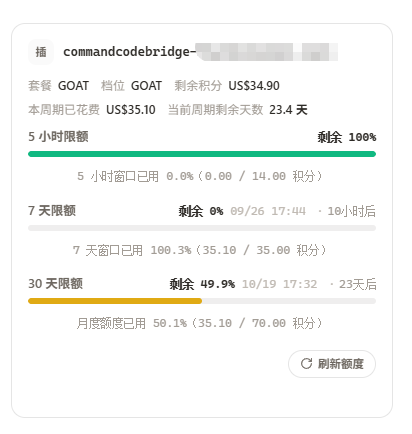

# CPA-Panel-PluginQuota · 管理面板插件额度补丁

给 [CLIProxyAPI](https://github.com/router-for-me/CLIProxyAPI)（CPA）的**官方管理面板**加上**插件额度支持**：
打上这个补丁后，任何声明了 `quota_provider` 能力的 CPA 插件都能在面板上直接看到额度卡片。



已知配套插件：[CommandCodeBridge](https://github.com/StarzL1kerain/CommandCodeBridge)、
[ClinePassBridge](https://github.com/StarzL1kerain/ClinePassBridge)。

> **三者分工**：插件负责**取数**，宿主（CPA）负责**转发**，本补丁只负责让**面板显示**。
> 不打这个补丁，插件照常工作 —— 只是面板上不会出现额度卡片（也不会报错），
> 额度仍可用插件自己的 `GET /v0/management/<pluginID>/quota` 或插件控制台页面查看。

## 适配的版本

| 项 | 版本 | 怎么查 |
|---|---|---|
| **CPA** | **v7.3.17**（本补丁实测所在版本）| `cli-proxy-api --version` |
| **管理面板** | **v1.24.2**（2026-09-22）<br>上游基线 commit `4530da271ba2e89810d4dccebc57f3091afa590a`<br>`src/` 整树指纹 sha256 `c18803e2…6d0`（398 个文件）| 对照 [官方面板仓库](https://github.com/router-for-me/Cli-Proxy-API-Management-Center) 的最新 release |

> ⚠️ **面板是随 CPA 分发的独立前端项目，CPA 更新时它也会更新。**
> 本仓库的 `management.html` 是在**上面那条基线上**打出来的**一整个前端文件**，
> 所以换成它之后，你的面板就固定在 v1.24.2：
>
> - **额度功能**一直能用 —— 它只依赖宿主的通用额度端点，跟面板版本无关。
> - 面板自身的**其它新界面/新功能**会停在 v1.24.2，看不到 CPA 后续面板的更新。
> - **想跟上新面板**：把 `scripts/build.sh` 里的基线 commit 换成官方面板的新版本，重打一次补丁
>   （上游改动大时补丁会上下文冲突，需手工对齐；逐文件改动清单见 [`CHANGES.md`](CHANGES.md)）。
> - 本仓库**不会**自动跟上游走，发行版永远对应上表里的面板版本。

## 用法

### 一步到位（推荐）

不需要 Node、不需要构建 —— 就是**把补丁版面板下载下来，覆盖掉原来那个文件**：

```bash
# 1) 找到你服务器上的面板文件（不确定就看下一节；Linux 一键脚本安装一般是下面这个）
CFG=~/.config/cliproxyapi

# 2) 备份（留一份原始面板，随时可回滚）
cp -a $CFG/static/management.html $CFG/static/management.html.bak-$(date +%Y%m%d-%H%M%S)

# 3) 下载补丁版，直接覆盖
curl -L -o $CFG/static/management.html \
  https://github.com/StarzL1kerain/CPA-Panel-PluginQuota/releases/latest/download/management.html

# 4) 浏览器 Ctrl+Shift+R 硬刷新
```

CPA **每次请求都从磁盘读**面板，**不需要重启**。校验：

```bash
curl -s http://127.0.0.1:1235/management.html | grep -o plugin_quota | wc -l    # 期望 14
```

> 面板是压缩后的多行文件，**必须**用 `grep -o … | wc -l` 数出现次数；
> `grep -c` 数的是行数，只会得到 2，容易误判成"没打上"。

仓库里的 `scripts/deploy.sh` 就是把上面几步串起来（自动备份 + 安装 + 校验）：

```bash
bash scripts/deploy.sh            # 其它安装方式：CFG=/你的配置目录 bash scripts/deploy.sh
```

### 各安装方式：找到文件 → 替换 → 不用重启

**补丁与安装方式无关**（就是替换一个静态文件）。通用流程 4 步，任何安装方式都一样：

```bash
# 1) 找到面板文件
find / -name management.html -not -path '*/node_modules/*' 2>/dev/null

# 2) 备份（把 <路径> 换成第 1 步的结果）
cp -a <路径> <路径>.bak-$(date +%Y%m%d-%H%M%S)

# 3) 覆盖
curl -L -o <路径> \
  https://github.com/StarzL1kerain/CPA-Panel-PluginQuota/releases/latest/download/management.html

# 4) 浏览器 Ctrl+Shift+R
```

**需不需要重启：不需要。** 宿主**每次请求都从磁盘读**面板，不是启动时缓存到内存 ——
换完文件下一次请求就生效；要刷新的只有浏览器（缓存）。Docker 里跑的是**同一份二进制**，行为一致。

| 安装方式 | 面板文件位置 |
|---|---|
| **Linux 一键安装脚本**（本仓库实测）| `~/.config/cliproxyapi/static/management.html` ✅ |
| **Docker**（已定位，见下）| 容器内 `/CLIProxyAPI/static/management.html` |
| Arch Linux (AUR) | `~/.cli-proxy-api/static/management.html`（按同一规则推出）|
| macOS (Homebrew) | `brew --prefix` 下的 `etc/` 同级 `static/`（按同一规则推出）|
| Windows / 源码编译 | 启动时 `-config` 指向的文件所在目录同级 `static/`（按同一规则推出）|

#### Docker

面板在**容器里面**（容器自带一份），宿主机上直接看不到，所以要进容器或用 `docker cp`。
**不要手抄任何容器 ID** —— 先让脚本自己找出来：三种过滤依次尝试，最后一种是通用探测。

```bash
# ① 按名字（子串匹配：cliproxyapi 能命中 cli-proxy-api 这类名字）
CID=$(sudo docker ps -qf name=cliproxyapi)
# ② 按镜像
[ -n "$CID" ] || CID=$(sudo docker ps -q --filter ancestor=eceasy/cli-proxy-api:latest)
# ③ 通用探测：正在运行的容器里，哪个有 /CLIProxyAPI 就是它
[ -n "$CID" ] || CID=$(sudo docker ps -q | while read -r id; do
  sudo docker exec "$id" test -d /CLIProxyAPI 2>/dev/null && echo "$id"
done)
: "${CID:?没匹配到 CPA 容器，请 sudo docker ps 看一眼真实的名字或镜像}"
echo "CPA 容器 = $CID"
```

> 上面用 `sudo` 是因为本机 docker 需要 root；如果你的账号在 `docker` 组里，去掉 `sudo` 即可。

**方式 A：直接拷进容器**（最快；改的是容器的可写层）

拿到 ID 后一条链路走完：下载 → 备份 → 覆盖 → 校验：

```bash
# ① 宿主机上下载补丁版
curl -L -o /tmp/management.html \
  https://github.com/StarzL1kerain/CPA-Panel-PluginQuota/releases/latest/download/management.html

# ② 备份容器里原来的面板，再覆盖进去
sudo docker exec "$CID" cp -a /CLIProxyAPI/static/management.html \
  /CLIProxyAPI/static/management.html.bak-$(date +%Y%m%d-%H%M%S)
sudo docker cp /tmp/management.html "$CID":/CLIProxyAPI/static/management.html

# ③ 校验（容器里没 curl 就直接查文件；期望 14）
sudo docker exec "$CID" sh -c 'grep -o plugin_quota /CLIProxyAPI/static/management.html | wc -l'
```

> ⚠️ `docker cp` 写进的是**容器的可写层**：`docker restart` 之后还在，但**容器被重建**就没了
> （重新 `docker run`、`docker compose up --force-recreate`、升级镜像都会重建），需要再拷一次。

**方式 B：把面板挂载进容器**（持久，重建也不丢）

```bash
docker run ... \
  -v /宿主机路径/management.html:/CLIProxyAPI/static/management.html \
  eceasy/cli-proxy-api:latest
```

面板文件就放在宿主机上（想换直接换宿主机那份）。官方文档本来就要求把配置、认证目录和**插件目录**
挂出来：`-v .../config.yaml:/CLIProxyAPI/config.yaml`、`-v .../auth-dir:/root/.cli-proxy-api`、
`-v .../plugins-dir:/CLIProxyAPI/plugins`。

已经在跑的容器要改成挂载，得**用同样参数重建一次**。切换前先确认容器里确实回退了
（上面那条 `grep -o plugin_quota … | wc -l` 得 `0`），并把现有挂载原样读出来照着补：

```bash
sudo docker inspect "$CID" --format '{{json .HostConfig.Binds}}'
```

> Docker 这一节是按上面 4 步流程整理的（路径已实测定位），**替换动作本身未实测**；实测过的是
> Linux 一键安装那条。有出入欢迎反馈。

### 自己从补丁构建（想换面板版本时）

```bash
bash scripts/build.sh          # 拉取锁定基线 → 套补丁 → 构建 → 校验；需要网络 + Node/npm
```

手动等价步骤：

```bash
curl -L -o panel.tar.gz \
  https://codeload.github.com/router-for-me/Cli-Proxy-API-Management-Center/tar.gz/4530da271ba2e89810d4dccebc57f3091afa590a
tar -xzf panel.tar.gz && cd Cli-Proxy-API-Management-Center-4530da271ba2e89810d4dccebc57f3091afa590a
git apply -p1 < /path/to/panel-plugin-quota.patch      # 无 git 时：patch -p1 < panel-plugin-quota.patch
npm install && npm run build                           # → dist/index.html（单文件）
```

## 两个必须注意的坑

### 1. 面板自动更新会覆盖补丁

确认 CPA 配置里有：

```yaml
remote-management:
  disable-auto-update-panel: true
```

否则上游发新面板时会**静默**把补丁覆盖掉（表现为额度卡片突然消失，原因见"另一条路"）。

### 2. 浏览器启发式缓存（"部署成功但界面没变"）

CPA 返回面板时**只给 `Last-Modified`，没有 `Cache-Control`、也没有 `ETag`**，浏览器会启用
启发式新鲜度（约"距今时间 × 10%"）—— 旧面板越久没更新，这个"不回服务器问"的窗口越长，
于是"明明换了文件，打开还是旧界面"，连普通 F5 都可能无效。

- 用户侧：`Ctrl+Shift+R`；无痕窗口；或访问 `.../management.html?v=2`
- 根治：在反代（如 nginx）给面板单独加 `add_header Cache-Control "no-cache" always;`，改完 `nginx -t && nginx -s reload`

## 补丁会不会被 CPA 自己覆盖？（怎么判断、怎么根治）

会有，但只有这几种情形。先判断"到底是谁动的"：

```bash
# 1) 面板现在是什么版本（我们的产物：plugin_quota 出现 14 次）
grep -o plugin_quota ~/.config/cliproxyapi/static/management.html | wc -l

# 2) 宿主有没有自己下载过面板（每次下载都会留痕；注意 model_updater.go 那些是模型刷新，无关）
journalctl --user -u cliproxyapi.service --since "12 hours ago" \
  | grep -E 'updater\.go:(247|300|308)|management asset'
```

| 现象 | 原因 | 对策 |
|---|---|---|
| **服务器上的文件是新的**，但打开还是旧界面 | **浏览器启发式缓存**（CPA 只发 `Last-Modified`，没有 `Cache-Control` / `ETag`） | `Ctrl+Shift+R`；根治见方式 1（顺带解决缓存）|
| 文件**变回原版**，且日志里没有下载记录 | 被别的进程覆盖（例如又跑了一次官方安装脚本、或在另一台实例上操作）| 用下面任一方式根治 |
| 日志里出现 `updater.go … management asset updated` | **宿主自己下载覆盖**：`disable-auto-update-panel` 为 `false`，或面板文件缺失触发首次下载 | 见方式 3。注意：`disable-auto-update-panel: true` **只阻止定期更新**，文件缺失时仍会下载一次 |

### 根治：四种方式（任选，推荐方式 1）

**方式 1 · nginx 直接伺服补丁版（最稳，也顺手解决缓存）**

```nginx
location = /management.html {
    alias /绝对路径/management.html;     # 指向补丁版那一份
    add_header Cache-Control "no-cache" always;
}
```

改完 `nginx -t && nginx -s reload`。面板不再经过 CPA —— 宿主怎么覆盖它自己那份都无所谓，浏览器也不会再拿到旧缓存。

**方式 2 · Docker：把面板挂载进容器**

```bash
docker run ... -v /宿主机路径/management.html:/CLIProxyAPI/static/management.html eceasy/cli-proxy-api:latest
```

`docker cp` 写进的是**容器可写层**：`docker restart` 之后还在，但容器一被**重建**（重新 `docker run`、`compose up --force-recreate`、升级镜像）就回退成镜像里的原版。

已经在跑的容器要改成这个挂载，得用同样的参数（或 compose 文件）**重建一次**；重建之后面板就固定在宿主机上那份，容器怎么重建都不丢。切过去之前，先跑上面那句 `grep -o plugin_quota … | wc -l` 确认容器里的确实被重置了（得 0），免得白折腾。

**方式 3 · 让"重新下载"下到我们的版本**

```yaml
remote-management:
  panel-github-repository: "https://github.com/StarzL1kerain/CPA-Panel-PluginQuota"
```

宿主若下载面板，取的就是本仓库 Release 里的 `management.html`（文件名正好一致）。前提是 GitHub API 可达（未鉴权时每出口 IP 每小时 60 次）；限流时会回退到官方面板。

**方式 4 · 兜底：把文件设为不可改**（需要 root；要更新时先解除）

```bash
sudo chattr +i ~/.config/cliproxyapi/static/management.html    # 解除：sudo chattr -i … 
```

## 生效后的表现

- 凭据卡片底部出现 **「点击此处刷新额度」**（点一下取数并渲染窗口条）
- 配额管理页多出 **「插件」** 分组
- 识别 `five_hour` / `weekly` / `seven_day` / `monthly` 四种窗口 token，其余原样显示

## 排错

**装了补丁、也有插件，但卡片上没有「点击此处刷新额度」** —— 按顺序查：

1. **硬刷新浏览器**（见上面的坑 2），先用无痕窗口排除缓存。
2. **面板是否真的换了**：`grep -o plugin_quota … | wc -l` 是否为 14。
3. **provider 三处是否一致**（最隐蔽的失败模式：不报错，就是没有按钮）：
   插件 `quota.describe` 返回的 `supported_providers`、凭证的 provider、宿主的
   `GET /v0/management/quota/providers` 必须是**同一个字符串**（如 `cline-pass`）。
4. **宿主是否发现了插件能力**：
   ```bash
   curl -s -H "Authorization: Bearer <管理密钥>" \
     http://127.0.0.1:1235/v0/management/quota/providers
   ```
   没有对应条目说明是插件侧的能力声明问题，不是面板补丁的问题。

## 回滚

```bash
mv ~/.config/cliproxyapi/static/management.html.bak-<时间戳> ~/.config/cliproxyapi/static/management.html
```

## 另一条路：让 CPA 自己从本仓库拉面板（有前提，已实测）

宿主内置面板下载/更新机制，靠这两个键：

```yaml
remote-management:
  panel-github-repository: "https://github.com/StarzL1kerain/CPA-Panel-PluginQuota"
  disable-auto-update-panel: false    # false = 允许宿主自己更新（这条路径会做摘要校验）
```

宿主会去查该仓库的**最新 Release**，下载其中名为 `management.html` 的资产 —— 本仓库的 Release 正好就是这个名字。

> Docker 里用这条路要注意：下载落点是**容器的可写层**，容器重建就没了。想在容器里持久，
> 要么把 `static/` 目录挂出来，要么就用上面 Docker 那节的拷入/挂卷方式。

**但这条路有前提，已实测**：查 Release 走的是 **GitHub API**，未鉴权时**每个出口 IP 每小时只有 60 次**。
在某台服务器上实测时，宿主的出口 IP 被限流，日志是：

```
[updater.go:247] failed to fetch latest management release information, trying fallback page
  error=fetch release: unexpected status 403: API rate limit exceeded for ...
[updater.go:300] management asset downloaded from fallback URL without digest verification
```

也就是说它会**静默回退到官方面板**（下载回来的是原版，额度功能消失，界面本身不报错）。
另外注意：`disable-auto-update-panel: true` 时，这条回退路径**不做摘要校验**。

结论：

- **宿主能稳定访问 GitHub API 时**，这条路最省事 —— 以后我们发新版，面板会自己跟着更新。
- **否则请用上面的手动方式**（"一步到位"）。
- 宿主的出口 IP 由配置里的**全局 `proxy-url`** 决定。如果那个代理的出口被 GitHub 限流，
  插件商店的 502 / `GitHub API rate limited` 与面板回退是**同一个原因**：换出口，或就用手动安装。

## 背景：为什么必须打补丁

宿主（CPA）的插件额度能力是**完整体**：`quota_provider` 能力键、`GET /v0/management/quota/providers`、
`POST /v0/management/quota/fetch`、`POST /v0/management/quota/reset`、`/v0/management/plugins/:id/quota`
都已在二进制里实现。问题在**面板前端**：

- `src/features/quota/providers/index.ts` 的 `QUOTA_ADAPTERS` 是**闭合静态表**（7 个内置厂商），没有回退
- `QuotaProviderType` 是**封闭联合类型**，`AuthFileQuotaSection.tsx` 里一串硬编码 `if` + `assertNever`
- `src/features/authFiles/logic.ts` 用 `QUOTA_PROVIDER_TYPES` 白名单**一票否决**

也就是说宿主的通用额度端点在面板里**一个消费者都没有**。官方最新版 **v1.24.2（2026-09-22）**
实测同样如此 —— **更新面板解决不了**，只能自己补。

补丁的做法是加**一个通用适配器**去接宿主的通用端点，而不是逐个厂商手写：
发现走 `/quota/providers`，取数走 `/quota/fetch`，渲染通用的 `groups[].buckets[]` + `summary[]`。
**一次投入，以后任何插件的额度都能显示。** 原理与设计细节见 [`docs/原理与设计.md`](docs/原理与设计.md)。

## 文件清单

| 文件 | 说明 |
|---|---|
| `management.html` | **补丁版产物**，2,814,625 字节，md5 `7f7ca30eadfe5946eb074df00c7c2889`，可直接部署。在额度补丁之上还含两处显示层改动（登录回调路由、提示文案），见 [`docs/原理与设计.md`](docs/原理与设计.md) 第 6 节 |
| `panel-plugin-quota.patch` | 相对基线的 unified diff，43,830 字节，23 段含 5 个新文件（UTF-8 + LF，前缀 `a/src/…`）|
| `CHANGES.md` | 逐文件改动记录：基线锁定、改动清单、设计取舍、未完成项、上游 PR 待办、验证记录 |
| `docs/原理与设计.md` | 面板为什么没有插件分支、归类规则、provider 一致性要求、缓存行为 |
| `scripts/deploy.sh` | 备份 → 安装 → 校验（支持 `CFG=` 指定配置目录）|
| `scripts/build.sh` | 取基线 → 套补丁 → 构建 → 校验 |
| `预期效果.png` | 打上补丁后的额度卡片 |

## 许可

本仓库的补丁与脚本：MIT。

`management.html` 是 [`router-for-me/Cli-Proxy-API-Management-Center`](https://github.com/router-for-me/Cli-Proxy-API-Management-Center)
（MIT，Copyright (c) 2026 Router-For.ME）打上本补丁后的**构建产物**，按上游 MIT 许可再分发，
完整许可文本见 [`LICENSE`](LICENSE)。
